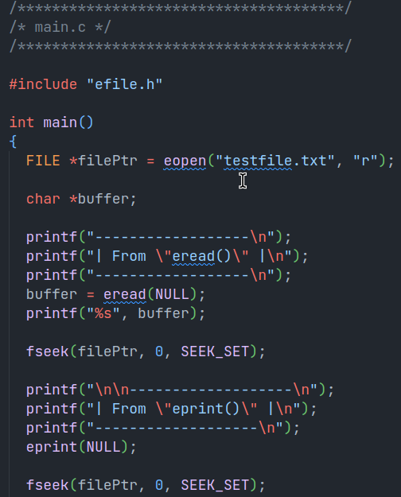
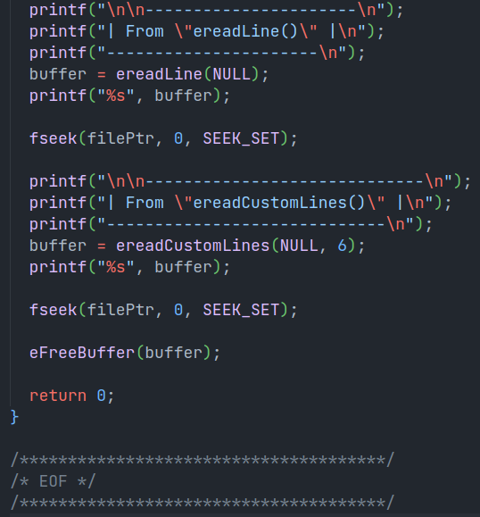
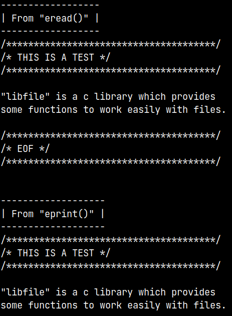
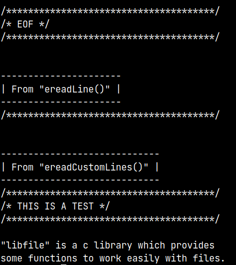

# libefile

`libfile` is a c library which provides some functions to work easily with files. As it is still in development it is not yet been converted into an library. Here are some examples.

To build run,

```bash
make
```

To clean run,

```bash
make clean
```

To debug run,

```bash
make debug
```

## How to use?

- `eclose(filePtr)`

  A macro for `fclose()`.

- `eFreeBuffer(bufferPtr)`

  A macro for `free()`.

- `eopen(char *fileName, char *fileMode)`

  It takes file name and file mode as arguments and returns file pointer.

- `eopenr(char *fileName)`

  It takes file name as argument, opens file in read mode and returns file pointer.

- `eopenw(char *fileName)`

  It takes file name as argument, opens file in write mode and returns file pointer.

- `eopena(char *fileName)`

  It takes file name as argument, opens file in append mode and returns file pointer.

- `eread(FILE *filePtr)`

  It takes file pointer or NULL as argument, if NULL is passed the file opened at the start will be selected. It reads that file and returns a pointer to the contents.

- `eprint(FILE *filePtr)`

  It takes file pointer or NULL as argument, if NULL is passed the file opened at the start will be selected. It prints the file contents.

- `ereadLine(FILE *filePtr)`

  It takes file pointer or NULL as argument, if NULL is passed the file opened at the start will be selected. It reads a single line from that file and returns a pointer to that.

- `ereadCustomLines(FILE *filePtr, int lines)`

  It takes file pointer or NULL as argument, if NULL is passed the file opened at the start will be selected. It also takes the number of lines as second argument, it is the number of lines to be read. It reads a lines from that file and returns a pointer to that.

## Results

`Example`





`Output`




