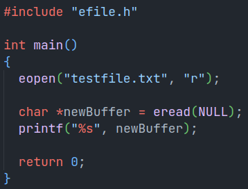
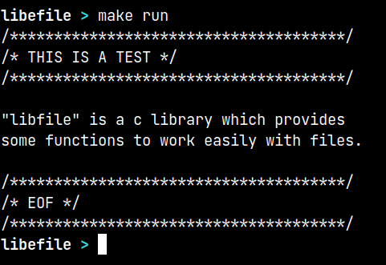

# libefile

`libfile` is a c library which provides some functions to work easily with files. As it is still in development it is not yet been converted into an library. Here are some examples.

To build run,

```bash
make
```

To clean run,

```bash
make clean
```

To debug run,

```bash
make debug
```

`Example`



`Output`


